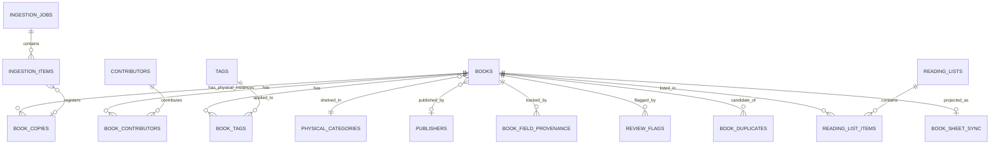

# Data Model

Status: Phase 0 design (revised after first architecture review, 2026-09-13), **implemented
as real, committed Drizzle migrations in Phase 4** (2026-09-16). This document now describes
the schema as actually built, not just as designed — §16 documents every point where
implementation diverged from this Phase 0 design, and why. Everywhere else in this document
that isn't called out in §16 was implemented exactly as designed here.

Conventions: `snake_case`, plural table names, singular `_id` foreign keys, every table has
`id uuid primary key default gen_random_uuid()` unless noted, and `created_at timestamptz`
on every table (plus `updated_at` where a row is mutated after creation).

## 1. Entity overview

**23 tables** (down from 25 in the first draft — see §12, the complexity review, for what
changed and why).

| Table | Purpose |
|---|---|
| `books` | The bibliographic/edition-level catalog record |
| `book_copies` | Physical instances the school owns of a given book/edition |
| `contributors` | People: authors, illustrators, photographers, translators |
| `book_contributors` | Book ↔ contributor, with role |
| `publishers` | Normalized publisher names |
| `book_languages` | Book ↔ additional language codes (multilingual editions) |
| `tags` | Normalized, typed digital tags |
| `book_tags` | Book ↔ tag |
| `physical_categories` | Admin-managed shelving categories (one per book) |
| `book_field_provenance` | Provenance + confidence evidence per tracked field, with history |
| `book_duplicates` | Candidate duplicate relationships between two books |
| `review_flags` | Open concerns requiring admin attention |
| `taxonomy_suggestions` | AI/admin-surfaced proposals for new/merged categories |
| `reading_lists` | Shared, accountless reading lists |
| `reading_list_items` | List ↔ book |
| `ingestion_jobs` | A single-add or bulk-import run |
| `ingestion_items` | Per-image processing state within a job |
| `book_identity_candidates` | Raw metadata-provider candidates considered per ingestion item |
| `metadata_provider_cache` | Cache of provider responses by normalized query |
| `book_sheet_sync` | Per-book Google Sheets sync state |
| `audit_log` | Admin-level structural/destructive change history |
| `system_settings` | Centralized configurable thresholds/settings |
| `login_attempts` | Basic brute-force throttling |

## 2. Books vs. copies

This is the most significant structural change in this revision (see review point 1, and §12 for the categorization).

### `books` — the bibliographic/edition-level record

Represents *this edition of this book* — one row per distinct edition the library catalogs,
regardless of how many physical copies exist.

| Column | Type | Notes |
|---|---|---|
| `id` | uuid PK | |
| `title` | text, not null | |
| `subtitle` | text | |
| `normalized_title` | text, not null | lowercased, punctuation/article-stripped; duplicate matching |
| `sort_title` | text, not null | leading-article-stripped, for alphabetical shelving order |
| `short_description` | text | app-generated, 1–2 sentences |
| `language_code` | text, not null | ISO 639-1, validated at the app layer (see §3) — no FK |
| `fiction_status` | enum(`fiction`,`nonfiction`,`unknown_mixed`), not null default `unknown_mixed` | |
| `age_min_months` | smallint | nullable, whole months — see §4 |
| `age_max_months` | smallint | nullable, whole months |
| `read_aloud_minutes_estimate` | numeric(4,1) | nullable |
| `read_duration_band` | enum(`under_5`,`five_to_ten`,`ten_plus`) | |
| `format` | enum(`board_book`,`picture_book`,`early_reader`,`chapter_book`,`informational_reference`,`activity_book`,`other`) | bibliographic format |
| `physical_size_exception` | enum(`regular`,`board_small`,`oversized_big`), not null default `regular` | shelving accommodation only — human-set, never inferred from a photo |
| `visual_media_type` | enum(`photography`,`watercolor`,`collage`,`digital_illustration`,`pencil`,`ink`,`painted`,`mixed_media`,`graphic_vector`,`other`,`unknown`)`[]` | **array**, not scalar — see §16 |
| `visual_realism` | enum(`real_photography`,`realistic_illustration`,`stylized_illustration`,`cartoon`,`abstract`,`mixed`,`unknown`) | value renamed from `stylized` — see §16 |
| `publisher_id` | uuid, FK → `publishers.id` | nullable |
| `imprint` | text | nullable |
| `publication_year` | smallint | nullable |
| `isbn_10` / `isbn_13` | text | nullable; partial unique index on `isbn_13` where not null |
| `edition` | text | nullable |
| `physical_category_id` | uuid, FK → `physical_categories.id` | nullable until categorized |
| `cover_drive_file_id` / `cover_drive_folder_id` / `cover_filename` / `cover_mime_type` | text | the **representative original capture** for this edition — see §5 |
| `cover_source_type` | enum(`teacher_upload`,`bulk_import`,`external_thumbnail`) | |
| `display_cover_url` | text | the **display cover** actually rendered in the app — see §5 |
| `display_cover_source` | enum(`derived_from_drive`,`external_provider_thumbnail`,`drive_proxy_fallback`) | which strategy produced `display_cover_url` |
| `review_status` | enum(`pending_review`,`active`,`archived`), not null default `pending_review` | denormalized visibility gate, kept in sync by application code |
| `created_at` / `updated_at` / `verified_at` | timestamptz | |
| `search_text` | text | **Phase 5.** Label-free, values-only text (`buildSearchIndexText`) — the source `search_vector` is generated from. Deliberately not the same text as the embedding document below; see `docs/SEARCH.md` §3. |
| `search_vector` | tsvector, `GENERATED ALWAYS AS (to_tsvector('english', coalesce(search_text, ''))) STORED` | **Phase 5.** GIN-indexed; never written directly. |
| `embedding` | vector(768) | **Phase 5.** Populated only by `npm run embeddings:generate`, never during a request. 768 is a storage contract matching `gemini-embedding-2`'s output — see `docs/SEARCH.md` §5. |
| `embedding_model` / `embedding_dimension` / `embedding_composition_version` / `embedding_source_hash` / `embedding_generated_at` | text / smallint / smallint / text / timestamptz | **Phase 5.** Records exactly what produced `embedding` — lets the backfill script distinguish "never embedded" from "data changed since" (hash mismatch) from "composition changed since" (version mismatch). |
| `read_duration_band` (revised) | enum, `GENERATED ALWAYS AS (case ... end) STORED` | **Phase 5.** Was a plain nullable column through Phase 4; now generated directly from `read_aloud_minutes_estimate`, making it the single authoritative source both the database and `lib/catalog/duration.ts::getReadDurationBand` agree with — never independently settable, never able to drift from the raw estimate. |

Phase 4 deliberately left `embedding`/`embedding_source_hash`/`embedding_generated_at` out
entirely (semantic search was out of scope that phase); Phase 5 added them, plus `search_text`/
`search_vector` and the `read_duration_band` column-generation change, in one new migration
(`drizzle/0001_mighty_war_machine.sql`) — the approved Phase 4 migration is untouched.

**Removed from this table in this revision:** `copy_count`, `home_location`,
`current_location`, `availability_status`, `work_group_id` — see below and §12.

### `book_copies` — physical instances

| Column | Type | Notes |
|---|---|---|
| `id` | uuid PK | never shown to teachers in v1 UI |
| `book_id` | uuid, FK → `books.id`, not null | |
| `home_location` | text | nullable, e.g. "Preschool Library" |
| `current_location` | text | nullable, e.g. "Blue Room" — independent of `home_location` so a copy can be temporarily elsewhere; future-ready, unused by any v1 screen |
| `availability_status` | enum(`on_shelf`,`in_classroom`,`unknown`), not null default `on_shelf` | future-ready, unused by any v1 screen |
| `acquired_at` | timestamptz | nullable |
| `source_ingestion_item_id` | uuid, FK → `ingestion_items.id` | nullable — which ingestion event registered this specific copy. A partial unique index (Phase 8 correction pass, `where source_ingestion_item_id is not null`) enforces "one ingestion item produces at most one physical copy" as a database-level backstop — the real guarantee is the application-level atomic-claim pattern in `src/lib/admin/persistence.ts`; this index is defense-in-depth, never something a caller is expected to catch a raw unique-violation from. |
| `created_at` | timestamptz | |

**Why this split, concretely:** a teacher adding a second physical copy of a book already in
the catalog (the "Add another copy" duplicate-resolution outcome, §7) now inserts **one new
`book_copies` row** pointing at the existing `books` row — never a second bibliographic
record. "Copies: 2" shown to a teacher is simply `count(*) from book_copies where book_id =
?`, computed on demand, not stored/denormalized anywhere (so it can never drift). This
directly enables "2 copies of the same edition, one in the preschool library, one in Blue
Room" without a checkout system — `current_location` differs per copy row, nothing else
about the record needs to duplicate. No per-copy UI exists in v1; `book_copies.id` is never
exposed to teachers, and admins see it only as a location list behind the derived count, if
that's ever built.

**Is a separate "Work" entity worthwhile?** No — and this is a distinct question from the
copies split above. A true bibliographic Work entity (FRBR-style Work → Expression →
Manifestation modeling, where "Work" carries its own canonical title/description separate
from any edition) is real bibliographic sophistication this collection doesn't need: it would
mean every query for "what is this book about" has to join through a Work layer, every admin
edit screen has to decide which layer a field belongs to, and it solves a problem (multiple
institutions cataloging the same abstract work in many editions/translations) that a single
1,500-book school library doesn't have. The lightweight `work_groups` linkage from the first
draft — an optional `books.work_group_id` pointing at a bare `(id, canonical_title)` table,
purely so "same story, different language" editions can be found together — is the right
level of sophistication *if and when it's needed*. It is not needed by any v1 screen, so this
revision **removes it from the schema entirely for now** (see §12) rather than carrying an
unused table and column. Adding it back later is a trivial additive migration (a new nullable
FK column plus a two-column table) with zero backfill cost against existing data, so nothing
is lost by deferring it.

## 3. Language representation

**Change in this revision:** the `languages` reference table from the first draft is removed
(§12). `books.language_code` and `book_languages.language_code` are plain `text` columns
holding an ISO 639-1 code, validated at the application layer against a single shared
constant (`src/lib/catalog/languages.ts` — the actual path; this document previously and
incorrectly said `lib/constants/languages.ts`, corrected in the Phase 4 correction pass), a
`code → display name` map covering the standard ISO 639-1 list (~150 codes, not just the
handful the development fixture catalog happens to use), exposed as a Zod-validated type for
validation everywhere it's used — search filters, autocomplete, facets, Quick Edit, admin edit.
This was a reference table with no admin-CRUD need (unlike `physical_categories`, which
genuinely must be admin-editable data) — a single application constant is simpler, requires no
join for the common single-language case, and is just as centralized/non-hard-coded as a table
would be, since it still lives in exactly one place.

`book_languages (book_id, language_code)` — composite PK — still exists for multilingual
editions, so a bilingual book matches a filter on either language while
`books.language_code` remains the primary/display value.

## 4. Age representation

**Canonical unit: whole integer months**, stored as `age_min_months` / `age_max_months` on
`books`. Chosen over whole years because preschool-relevant distinctions (24–36 vs. 36–48
months) are coarser than a year but finer than "2 vs. 3 years old" — a whole-years column
would force real information loss at exactly the ages this collection cares most about,
while the collection's upper end (elementary/fifth-grade books) is served just as well by
months as by years.

**Validation bounds:** `age_min_months >= 0`, `age_max_months <= 216` (18 years — a generous
outer bound, not a claim about the collection's actual range, which in practice runs roughly
24–132 months / 2–11 years), and `age_min_months <= age_max_months` whenever both are set.

**Unknown / open-ended ages:**
- Both null → age is entirely unknown; the UI shows "Age not specified" and the book is
  flagged `missing_metadata`.
- `age_max_months` null with `age_min_months` set → open-ended lower bound (e.g., "3 and up"),
  displayed as "3+ years."
- `age_min_months` null with `age_max_months` set → open-ended upper bound (rare, e.g., "up
  to 2 years"), displayed as "Up to 2 years."

**Display conversion** happens in one pure, unit-tested function
(`lib/catalog/age.ts::formatAgeRange`), never inline in a component: floor the minimum to the
enclosing year, ceil the maximum to the enclosing year (unless it lands exactly on one).
Examples: 24–36mo → "2–3 years"; 36–48mo → "3–4 years"; 48–72mo → "4–6 years"; 96–132mo →
"8–11 years." The stored months value is never shown to a teacher directly — only this
derived, friendly range is.

Provenance/confidence for age (external vs. AI-inferred vs. teacher/admin-set) is tracked
exactly like any other field, via `book_field_provenance` with `field_key = 'age_range'`
(§6).

## 5. Original capture vs. display cover

Two distinct concepts, modeled and named explicitly per the review:

- **Original capture** — the actual photograph a staff member took of a physical book's
  cover, or the original file for a bulk-imported photo. Archived to Google Drive, retained
  for provenance/review, never shown directly to a browser. Referenced on `books` via
  `cover_drive_file_id` / `cover_drive_folder_id` / `cover_filename` / `cover_mime_type` —
  kept at the edition level (not per-copy) because a display cover only needs one
  representative image per edition; the ingestion event that produced it is separately
  traceable through `ingestion_items` → `book_copies.source_ingestion_item_id` if deeper
  provenance is ever needed.
- **Display cover** — whatever image is actually efficient to render in search results and
  book detail. Referenced via `display_cover_url` + `display_cover_source`, and is
  deliberately **not assumed to be the Drive file** — see the fallback order below.

**v1 fallback order** (configurable via `system_settings`, not hard-coded):

1. **`derived_from_drive`** (default/primary) — a resized, optimized copy generated from our
   own photographed original at ingestion time, stored in Supabase Storage (reusing
   infrastructure already provisioned for the database, rather than adding a fourth vendor —
   this is the "second image-storage service" the review asked me to justify: it's justified
   because Drive isn't designed for fast public hotlinking at low latency, and Supabase
   Storage is already part of the stack). This is preferred **first**, not as a fallback,
   deliberately: it's a photo of the school's actual copy, which matters for a
   "where do I find this on the shelf" tool more than a generic internet thumbnail of a
   possibly-different printing.
2. **`external_provider_thumbnail`** — a metadata provider's (Google Books) cover thumbnail,
   used only when our own derived image isn't available (e.g., a processing failure, or a
   pre-existing record created before this pipeline existed).
3. **`drive_proxy_fallback`** — a server-side route that streams the Drive original on demand.
   Slower and exposed to Drive API latency/rate limits, so it's the last resort, never the
   primary path — but it guarantees something always renders even if the other two fail.

## 6. Provenance & confidence

### `book_field_provenance`

**Redesigned in this revision** (review point 3; see §12 for the categorization) to (a) avoid a rigid database enum for
which fields are tracked, and (b) preserve a history of evidence rather than only the latest
value.

| Column | Type | Notes |
|---|---|---|
| `id` | uuid PK | |
| `book_id` | uuid, FK → `books.id`, not null | |
| `field_key` | text, not null | validated against a centralized registry (`src/lib/metadata/fieldRegistry.ts`, implemented in the Phase 4 correction pass — a Zod-validated type, not a database enum), so adding a newly-tracked field is a code change, not a migration |
| `source_type` | enum(`external_provider`,`ai_inferred`,`cover_visible`,`human_corrected`,`human_verified`), not null | see below |
| `source_label` | text | nullable, e.g. "Google Books", "Claude vision v1" |
| `confidence` | numeric(3,2) | nullable |
| `confidence_level` | enum(`high`,`medium`,`low`) | nullable, derived from `confidence` against `system_settings` thresholds |
| `notes` | text | nullable |
| `is_current` | boolean, not null default `true` | see below |
| `created_at` | timestamptz, not null | |

**`source_type` is a real database enum** (unlike `field_key`) because it's a small, stable
classification of *kind of evidence* that isn't expected to grow — distinct from `field_key`,
which names *which* piece of metadata, and which the brief anticipates will evolve as the
product does:

- `external_provider` — an authoritative external source (Google Books, Open Library).
- `ai_inferred` — vision/LLM-derived, not yet reviewed by a human.
- `cover_visible` (Phase 7) — the value is genuinely visible/printed on the book's
  front cover, extracted by Gemini vision but grounded in real visual evidence on
  the cover itself — distinct from `ai_inferred`, which covers a model's broader
  inference/enrichment guesses (description, tags, category) not directly backed
  by cover text. Use it only when the stored field is genuinely supported by
  visible cover evidence (e.g., a title/author/ISBN actually printed on the
  cover); do not use it merely because AI looked at the image.
- `human_corrected` — a human (teacher or admin) changed the value from what it was.
- `human_verified` — a human reviewed an existing (often AI-inferred) value and explicitly
  accepted it without changing it — e.g., tapping **Confirm** on the Add-a-Book screen
  records `human_verified` for every field shown there; using **Quick Edit** to change one of
  those fields instead records `human_corrected` for that field.

**History, not just current state:** rather than one row per `(book_id, field_key)` that gets
overwritten, each new determination inserts a **new row** and sets the previous current row's
`is_current` to `false`. A **partial unique index on `(book_id, field_key) WHERE is_current`**
guarantees exactly one current row per field for fast lookups (the same query pattern as
before), while the full evidence trail — "Open Library said X, then AI inferred Y, then a
teacher corrected it to Z" — remains queryable by simply reading all rows for that
`(book_id, field_key)` ordered by `created_at`. Duplicate-candidate confidence is still not
stored here — it lives on `book_duplicates.similarity_score`, a property of a candidate pair,
not a single book.

## 7. Duplicates

### `book_duplicates`

Unchanged in structure from the first draft:

| Column | Type | Notes |
|---|---|---|
| `id` | uuid PK | |
| `book_id_a` / `book_id_b` | uuid, FK → `books.id`, not null | |
| `relationship_type` | enum(`exact_copy_same_edition`,`same_title_different_edition`,`same_work_different_language`,`false_match`,`unresolved`), not null default `unresolved` | |
| `similarity_score` | numeric(3,2) | |
| `detected_by` | enum(`image_hash`,`isbn_match`,`title_author_match`,`admin_manual`), not null | |
| `status` | enum(`pending`,`confirmed`,`rejected`), not null default `pending` | |
| `resolved_by` / `resolved_at` / `notes` | text / timestamptz / text | nullable |
| `created_at` | timestamptz | |

**Resolution outcomes, restated against the books/copies split:**
- **Add another copy** → insert one new `book_copies` row against the existing `books` row;
  `relationship_type = exact_copy_same_edition, status = confirmed` recorded for the audit
  trail; no second `books` row created.
- **Different edition** → a new `books` row (and its own first `book_copies` row), optionally
  linked to the original via a future `work_groups` relationship if that's reintroduced
  (§2).
- **Not a match** → `status = rejected`.
- **Review later** → left `pending` with a `duplicate_uncertain` review flag.

## 8. Review, flags & taxonomy evolution

### `review_flags`

Unchanged: `id`, `book_id`, `flag_type` (enum:
`user_flagged`,`low_identification_confidence`,`duplicate_uncertain`,`metadata_conflict`,
`category_uncertain`,`missing_metadata`,`visual_style_uncertain`,`import_error`,
`teacher_requested_review`), `status` (enum: `open`,`resolved`,`dismissed`), `detail`,
`created_at`, `resolved_at`, `resolved_by`, `resolution_note`.

### `taxonomy_suggestions`

**Simplified in this revision** (§12): the separate `taxonomy_suggestion_evidence` join table
is removed; supporting books are now a plain array column, since this is a low-volume,
rarely-reverse-queried admin feature where a full join table added normalization the actual
usage doesn't need.

| Column | Type | Notes |
|---|---|---|
| `id` | uuid PK | |
| `suggested_name` | text, not null | |
| `reason` | text, not null | |
| `supporting_book_ids` | uuid[], not null default `'{}'` | GIN-indexable if reverse lookup is ever needed |
| `status` | enum(`pending`,`approved`,`rejected`,`merged`,`postponed`), not null default `pending` | |
| `decision_note` | text | nullable |
| `resolved_category_id` | uuid, FK → `physical_categories.id` | **Phase 8.** Set on `approved` (the brand-new category this suggestion became) or `merged` (the existing category it was merged into); null otherwise. A small nullable FK rather than relying on `decision_note` prose for this relational fact. |
| `created_at` / `reviewed_at` | timestamptz | nullable where applicable |
| `reviewed_by` | text | nullable — always the literal `"admin"` (§Accounts); never a named individual |

`physical_categories` gains two Phase 8 columns: `description` (text, nullable — optional
admin-facing shelving guidance, never shown to a teacher as bibliographic fact) and
`display_order` (smallint, not null default `0` — a plain sort hint for the admin category
list). Neither changes `id`/`slug` identity; a label rename touches only `label`.

## 9. Reading lists

Unchanged: `reading_lists (id, name not null, created_by nullable, created_at, updated_at)`;
`reading_list_items (list_id, book_id, added_at, note nullable)`, composite PK
`(list_id, book_id)`.

## 10. Ingestion (shared by single-add and bulk import)

### `ingestion_jobs`

Unchanged: `id`, `job_type` (enum: `single_add`,`bulk_import`,`reimport`), `status` (enum:
`pending`,`running`,`completed`,`failed`,`cancelled`), `source` (enum:
`teacher_capture`,`admin_bulk_drive`), `started_at`/`completed_at`, `total_items` /
`processed_items` / `failed_items` / `skipped_items`, `config jsonb`, `created_by`, `notes`.

### `ingestion_items`

**One change:** `resulting_book_id` is replaced with **`resulting_copy_id`**, a nullable FK
to `book_copies.id` — each ingestion event fundamentally registers one physical copy
encounter; the associated bibliographic record is reachable via
`book_copies.book_id`. This keeps the ingestion pipeline's output model consistent with the
books/copies split rather than pointing at two overlapping targets.

| Column | Type | Notes |
|---|---|---|
| `id` | uuid PK | |
| `job_id` | uuid, FK → `ingestion_jobs.id`, not null | |
| `drive_file_id` | text, not null | |
| `content_hash` / `perceptual_hash` | text | |
| `status` | enum(`pending`,`processing`,`completed`,`needs_review`,`failed`,`skipped_duplicate`), not null default `pending` | |
| `review_reason` | text | nullable, e.g. `multiple_books_or_ambiguous_image` |
| `intake_draft` | jsonb | nullable (Phase 7) — see below |
| `resulting_copy_id` | uuid, FK → `book_copies.id` | nullable |
| `pending_book_id` | uuid, FK → `books.id` | nullable (Phase 8) — see below |
| `error_message` | text | nullable |
| `retry_count` | smallint, not null default 0 | |
| `started_at` / `completed_at` | timestamptz | nullable |
| `created_at` | timestamptz | |

**`intake_draft` (Phase 7)** — everything needed to resume a single-book intake
without re-uploading the photo or re-running any provider call: confirmed Drive
source metadata (file id/filename/MIME/size/checksum — never the ephemeral
resumable upload session URI), validated cover-identification evidence, normalized
metadata candidates, the reconciliation result, duplicate-candidate outcome,
enrichment suggestion, category suggestion, and any teacher edits already made.
Postgres enforces no schema on a `jsonb` column — the real contract is
`src/lib/intake/draft.ts`'s `IntakeDraftSchema` (Zod), validated on every write
(`parseIntakeDraft`) and read (`readIntakeDraft`, which degrades to "start a fresh
intake" rather than throwing on a shape it doesn't recognize — e.g. after a future
schema-version bump). Explicit boundary: a validated **application-domain**
draft, never an arbitrary raw AI response dump — it never contains a secret, an
image byte, or a resumable Drive upload session URI, and never persists verbose
model chain-of-thought or raw AI prose, only the already-schema-validated
structures the vision/enrichment provider calls produce.

**`pending_book_id` (Phase 8)** — the durable link from a Review Later ingestion item to the
optional `pending_review` book `saveForReview()` may have created for it. Added because no
reliable direct relationship existed before: `resulting_copy_id` is only ever set once an item
reaches `completed` (never for `needs_review`), and the only prior record of "which book, if
any, did this item create" was `audit_log.detail` JSON on the `intake_marked_for_review`
event — never meant to be queried as a relational join. Nullable: a genuinely ingestion-only
Review Later item (not enough trustworthy identity data for even a pending book) has no pending
book at all, and this stays null rather than being guessed. Set going forward by
`saveForReview()`; `src/db/backfillPendingBookLinks.ts` backfills pre-existing rows
conservatively (only when exactly one unambiguous `audit_log` record names the book and no
other ingestion item already claims it), leaving a genuinely ambiguous row null.

### `book_identity_candidates` / `metadata_provider_cache`

Unchanged in *purpose* from the first draft — every provider candidate considered is retained
for audit (`book_identity_candidates`), and provider responses are cached by normalized query
(`metadata_provider_cache`) for cost/rate-limit control — but this document never actually
specified their columns ("unchanged from the first draft" pointed at a draft that didn't list
them either). Phase 4 fills them in, consistent with the stated purpose above and the rest of
this schema's conventions:

**`book_identity_candidates`**

| Column | Type | Notes |
|---|---|---|
| `id` | uuid PK | |
| `ingestion_item_id` | uuid, FK → `ingestion_items.id`, not null | |
| `provider` | text, not null | e.g. `"google_books"`, `"open_library"` |
| `provider_identifier` | text | nullable, e.g. the provider's own volume/work ID |
| `raw_response` | jsonb | nullable, the full provider payload for this candidate |
| `match_confidence` | numeric(3,2) | nullable |
| `was_selected` | boolean, not null default `false` | which single candidate the pipeline actually used |
| `created_at` | timestamptz | |

**`metadata_provider_cache`**

| Column | Type | Notes |
|---|---|---|
| `id` | uuid PK | |
| `provider` | text, not null | |
| `normalized_query` | text, not null | |
| `response` | jsonb, not null | |
| `created_at` | timestamptz | |
| `expires_at` | timestamptz | nullable |

Unique constraint on `(provider, normalized_query)` — one cached response per provider per
normalized query, so a repeat lookup during bulk import is a cache read, not a re-fetch.

## 11. Sheets sync, audit & configuration

`book_sheet_sync`, `audit_log`, `system_settings`, `login_attempts` are unchanged from the
first draft.

## 12. Schema complexity review

Every table from the first draft (plus the new `book_copies`) categorized as **(A)** essential
for v1, **(B)** justified now because retrofitting it later would be materially more costly,
or **(C)** deferrable/removable — with the actual disposition applied.

| Table | Category | Disposition | Reasoning |
|---|---|---|---|
| `books` | A | Kept | Core record |
| `book_copies` | B | **Added** this revision | Explicitly requested; retrofitting instance-level location after real inventory data exists would require migrating ambiguous existing `copy_count` data — cheaper to do this split now, before any data exists |
| `contributors`, `book_contributors` | A | Kept | Required for reliable author/illustrator search |
| `publishers` | B | Kept | Needed for real, de-duplicated autocomplete data; normalizing free text after 1,500 inconsistent entries exist is a painful cleanup |
| `languages` (reference table) | C | **Removed** | No admin-CRUD need justified a table; replaced with a single application constant (§3) |
| `book_languages` | B | Kept | Explicit multilingual-editions requirement |
| `tags`, `book_tags` | A | Kept | Core "many digital tags" requirement |
| `physical_categories` | A | Kept | Explicitly required to be a real, admin-managed table |
| `book_field_provenance` | B | Kept, redesigned | Retrofitting provenance/confidence after ungoverned AI enrichment already ran would be far worse than designing it in now |
| `book_duplicates` | A | Kept | Explicit 4-way duplicate distinction is a core requirement |
| `work_groups` | C | **Removed** | Zero v1 UI usage, explicitly "optional future" in the original brief; adding it back later is a trivial additive migration with no backfill cost |
| `review_flags` | A | Kept | Admin queues depend directly on this |
| `taxonomy_suggestions` | B | Kept, simplified | Core Phase 8 requirement; its evidence join table (below) was the actual overmodeling, not this table |
| `taxonomy_suggestion_evidence` | C | **Removed**, folded into `taxonomy_suggestions.supporting_book_ids` | A join table added normalization this low-volume, rarely-reverse-queried admin feature doesn't need |
| `reading_lists`, `reading_list_items` | A | Kept | Explicit v1 feature |
| `ingestion_jobs`, `ingestion_items` | A | Kept | Core resumable/idempotent import requirement |
| `book_identity_candidates` | B | Kept | Directly serves "reconcile candidates, don't blindly take the first result," and gives admins a real audit trail instead of a black box for misidentified books |
| `metadata_provider_cache` | B | Kept | Directly serves explicit cost/rate-limit-control requirement for bulk import |
| `book_sheet_sync` | B | Kept | Incremental Sheets sync cannot track drift without this |
| `audit_log` | B | Kept | Already scoped narrowly to admin destructive actions only, per explicit requirement |
| `system_settings` | A | Kept | Required as soon as any threshold exists (Phase 1 login throttling, Phase 5 ranking weights, Phase 7 confidence routing) |
| `login_attempts` | A | Kept | Needed starting Phase 1, not deferrable |

**Net result: 25 → 23 tables**, with three genuine removals (`languages`, `work_groups`,
`taxonomy_suggestion_evidence`) and one genuinely necessary addition (`book_copies`). No
normalization was removed where it protects a stated requirement — every cut was a table that
existed for reference completeness or future-proofing rather than a current, stated need.

## 13. How this schema satisfies the requested requirements

| Requirement | Where |
|---|---|
| Books | `books` |
| Contributors/authors/illustrators | `contributors`, `book_contributors` |
| Publishers/imprints | `publishers`, `books.imprint` |
| Languages | `books.language_code` / `book_languages` (app-validated ISO 639-1) |
| Digital tags | `tags`, `book_tags` |
| One primary physical category | `books.physical_category_id` |
| Formats | `books.format` |
| Illustration/media metadata | `books.visual_media_type`, `books.visual_realism`, `tags` (type `visual_subject`) |
| Age ranges | `books.age_min_months` / `age_max_months` |
| Read-aloud duration | `books.read_aloud_minutes_estimate`, `books.read_duration_band` |
| **Physical copies, distinct from the catalog record** | `book_copies` |
| **Future home/current location, per physical copy** | `book_copies.home_location` / `current_location` / `availability_status` |
| Review flags | `review_flags` |
| Duplicate relationships | `book_duplicates` |
| Metadata provenance (with history) | `book_field_provenance` |
| AI confidence | `book_field_provenance` |
| Taxonomy suggestions | `taxonomy_suggestions` |
| Reading lists | `reading_lists`, `reading_list_items` |
| Ingestion jobs/items | `ingestion_jobs`, `ingestion_items` |
| Google Drive references | `books.cover_drive_*`, `ingestion_items.drive_file_id` |
| Google Sheets synchronization | `book_sheet_sync` |
| Future audit/change history | `audit_log` |

## 14. Core relationships (simplified)

## 15. Changelog

**2026-09-13 — Phase 0 review revision:**
- Split `books` into `books` (bibliographic/edition) + new `book_copies` (physical instances)
  — moved `home_location`, `current_location`, `availability_status` to `book_copies`;
  removed `copy_count` (now derived on demand).
- Removed `languages` reference table; `language_code` columns are now app-validated text.
- Removed `work_groups` table and `books.work_group_id` column — deferred until an actual
  same-work/different-language case exists in the collection.
- Renamed `book_field_status` → `book_field_provenance`; redesigned from an upsert-in-place
  table to an append-with-supersede table (`is_current` + partial unique index) preserving
  full evidence history; `source_type` enum revised to
  `external_provider | ai_inferred | human_corrected | human_verified`.
- Removed `taxonomy_suggestion_evidence`; folded into `taxonomy_suggestions.supporting_book_ids`.
- `ingestion_items.resulting_book_id` → `resulting_copy_id` (FK to `book_copies`).
- `age_min` / `age_max` renamed to `age_min_months` / `age_max_months`; canonical unit locked
  as whole months (§4).
- Both open questions from the first draft are resolved (age unit; field-key vocabulary) —
  no open questions remain in this revision.

**2026-09-16 — Phase 4 implementation:**
- All 23 tables implemented as committed Drizzle ORM migrations under `drizzle/` (generated via
  `drizzle-kit generate`, applied via `npm run db:migrate` — never `drizzle-kit push`). See
  `docs/DATABASE_SETUP.md`.
- The 48-book fixture catalog (`src/lib/catalog/fixtures.ts`) became seed data (`src/db/seed.ts`) with
  stable, hardcoded UUIDs — not the fixtures' string slugs, which remain URL-facing identifiers
  only for `physical_categories.slug`, never a table primary key.

## 16. Phase 4 as-built status

Every deviation from the design above, and why:

- **`books.visual_media_type` is a Postgres array of the enum, not a scalar column.** The
  design table in §2 originally listed it as a single value, but Phase 0's own requirement
  (carried into Phase 2's search) is that a book can match a multi-valued illustration-style
  query like "real pictures of animals" — a single-valued column can't represent a book that's
  genuinely both `photography` and `collage`, for example. Implemented as
  `visualMediaTypeEnum("visual_media_type").array()` in `src/db/schema/books.ts`. This is the
  smallest correction that makes the column able to represent what Phase 2's search already
  needed — not a new requirement invented in Phase 4. See `docs/DECISIONS.md`.
- **`visual_realism`'s `stylized` value is named `stylized_illustration`.** Purely a naming
  clarification — `stylized` alone was ambiguous next to `realistic_illustration` and
  `cartoon`; no meaning changed, no data lost. Also added a DB-only `unknown` value (matching
  the pattern every other classification enum in this schema already uses for "not yet
  determined") — no seed book uses it, and the repository layer's projection falls back to a
  narrow constant if it's ever encountered, documented in `src/db/repositories/bookRepository.ts`.
- **`embedding` / `embedding_source_hash` / `embedding_generated_at` were not added to `books`
  at all.** Phase 4's brief explicitly scopes semantic search, embeddings, and pgvector out —
  adding an unused `vector(N)` column with an invented placeholder dimension would misrepresent
  a real decision (which embedding provider, and what dimension) as already made. Deferred
  entirely; §13/pgvector remains an accurate description of Phase 5's future work, not
  something partially started.
- **`book_identity_candidates` and `metadata_provider_cache` now have real, specific columns**
  (§10) — the Phase 0 draft never actually listed them ("unchanged from the first draft"
  pointed at a first draft that also didn't specify them). Filled in during implementation,
  consistent with each table's stated purpose.
- **Everything else in this document — every other table, column, index, and constraint —
  was implemented exactly as designed**, including the full provenance-history model (§6), the
  books/copies split with copy count always a derived `count(*)` (§2), the circular
  `book_copies` ↔ `ingestion_items` foreign key (§10, resolved with Drizzle's `AnyPgColumn`
  lazy-reference form), and the age-representation rules (§4).
- **Not built in Phase 4, and not part of this schema's job to solve:** Reading Lists moved
  from `localStorage` to these same `reading_lists` / `reading_list_items` tables — see
  `docs/DECISIONS.md`, "Reading Lists: from localStorage to Postgres," and
  `docs/ARCHITECTURE.md` §20. The rate limiter described in `docs/SECURITY.md` still keeps its
  Phase 1 in-memory implementation — wiring it to `login_attempts` for real persistence was
  deliberately left out of Phase 4's scope to avoid unrelated scope creep.

**Correction pass (2026-09-16) — closing acceptance gaps in the schema's own promises, not new
design:**

- **`book_languages` is now actually read, not just written.** The schema and seed script were
  always correct (§3); `DrizzleBookRepository` simply never batch-loaded the relation, so a
  multilingual book's additional languages never reached the application layer. Fixed — see
  §3's updated wording and `docs/DECISIONS.md`.
- **The `src/lib/metadata/fieldRegistry.ts` module §6 describes now actually exists** (it did
  not, until this pass) — this document's path claim was correct in intent, wrong in the actual
  filename casing (`fieldRegistry.ts`, not `field-registry.ts`, matching this project's
  camelCase file-naming convention elsewhere in `src/lib/`).
- No schema/migration changes were needed for either fix — both were purely an
  application-code/repository-layer gap, exactly the kind of thing this schema's own design
  (a plain `text` `field_key`, a real relational `book_languages` table) was already built to
  support without a migration.

## 17. Phase 5 as-built status

- **`embedding` / `embedding_model` / `embedding_dimension` / `embedding_composition_version` /
  `embedding_source_hash` / `embedding_generated_at` added, exactly as §2 above describes** —
  the decision §16 deferred (which provider, what dimension) is now made and documented:
  `vector(768)`, matching Gemini's `gemini-embedding-2`. One new migration
  (`drizzle/0001_mighty_war_machine.sql`); the approved Phase 4 migration is untouched.
- **`read_duration_band` changed from a plain nullable column to a `GENERATED ALWAYS AS`
  column**, derived from `read_aloud_minutes_estimate` — closes a real drift risk (the column
  and the raw estimate could previously disagree if only one was updated) and makes it the
  single authority `lib/catalog/duration.ts::getReadDurationBand` mirrors exactly.
- **`search_text`/`search_vector` added** — see §2. `search_text` is deliberately not the same
  text Phase 5's embedding document composes (`buildEmbeddingDocument`); see `docs/SEARCH.md`
  §3 for the real bug (a structural label leaking into full-text-searchable content) that drove
  this split.
- **`pg_trgm` and `vector` Postgres extensions enabled** — the first two statements of the new
  migration.
- **No changes to any other table.** Reading Lists, provenance, ingestion, and every other
  Phase 4 table are byte-for-byte unchanged this phase.

**Correction pass (2026-09-17):**

- **A second migration, `drizzle/0002_flimsy_goliath.sql`** — corrects the trigram index to
  target `books.title`/`contributors.name` (the columns the trigram queries actually compare
  against) instead of the unused `books.search_text` index §16/§17 above originally shipped.
  Found via `EXPLAIN ANALYZE` at scale; see `docs/SEARCH.md` §3 and `docs/DECISIONS.md`.
- **`books.isbn10`/`isbn13` (already part of the Phase 4 schema, §2) are now populated for two
  real fixture books** (`src/lib/catalog/fixtures.ts`: "The Very Hungry Caterpillar," "The
  Gruffalo") with their real published ISBNs — specifically so the search evaluation dataset
  (`docs/SEARCH.md` §11) could include real ISBN-10/13 known-item cases without fabricating a
  synthetic book. No fixture had ever recorded an ISBN before this. No schema change — the
  columns already existed and were simply never written to.
- **No third `.sql` migration for the existing-database `search_text` backfill** — a deliberate
  choice, explained in `docs/DECISIONS.md`, to avoid reimplementing `buildSearchIndexText()`'s
  composition logic a second time in raw SQL. See `docs/SEARCH.md` §4.

**2026-09-20/21 — Phase 7 implementation (Add a Book):**
- **`provenance_source_type` enum gains `cover_visible`**, inserted before
  `human_corrected` — see §6 for the exact evidence-boundary distinction from
  `ai_inferred`.
- **`ingestion_items.intake_draft` (jsonb, nullable) added** — see §10 for the
  full contract and its `IntakeDraftSchema` validation boundary.
- **No other schema changes.** One migration
  (`drizzle/0003_naive_silver_surfer.sql`, both statements above).

**2026-09-22 — Phase 8 implementation (Admin Review + Taxonomy):**
- **`physical_categories` gains `description` (text, nullable) and `display_order`
  (smallint, not null default `0`)** — see §12/§Accounts-adjacent category
  section above. Neither changes `id`/`slug` identity.
- **`ingestion_items.pending_book_id` (uuid, FK → `books.id`, nullable) added** —
  see §10 above for the full rationale and backfill behavior.
- **`taxonomy_suggestions.resolved_category_id` (uuid, FK → `physical_categories.id`,
  nullable) added** — see §8 above.
- **No new tables.** One migration (`drizzle/0004_phase8_admin_review_taxonomy.sql`,
  four `ALTER TABLE ADD COLUMN` + two `ADD CONSTRAINT` statements, all additive).

**2026-09-22 — Phase 8 correction pass:**
- **`book_copies` gains one partial unique index**, `book_copies_source_ingestion_item_unique`
  (`source_ingestion_item_id`, `where source_ingestion_item_id is not null`) — a database-level
  defense-in-depth backstop for "one ingestion item produces at most one physical copy," see
  above. One migration (`drizzle/0005_phase8_correction_exactly_once_copy.sql`, one
  `CREATE UNIQUE INDEX` statement). No new tables, no other schema changes.
