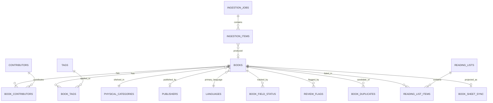

# Data Model

Status: Phase 0 — proposed schema design, not yet implemented as migrations. This is the
design to be reviewed before Phase 4 turns it into real SQL migrations. Column types are
indicative of intent (e.g. "text", "smallint", "numeric(3,2)") rather than final SQL syntax.

Conventions used throughout: `snake_case`, plural table names, singular `_id` foreign keys,
every table has `id uuid primary key default gen_random_uuid()` unless noted, and
`created_at timestamptz` on every table (plus `updated_at` where a row is ever mutated after
creation).

## 1. Entity overview

| Table | Purpose |
|---|---|
| `books` | The catalog record itself |
| `contributors` | People: authors, illustrators, photographers, translators |
| `book_contributors` | Book ↔ contributor, with role |
| `publishers` | Normalized publisher names |
| `languages` | Reference list of languages (ISO-based) |
| `book_languages` | Book ↔ additional languages (for multilingual editions) |
| `tags` | Normalized, typed digital tags |
| `book_tags` | Book ↔ tag |
| `physical_categories` | Admin-managed shelving categories (one per book) |
| `book_field_status` | Unified provenance + confidence per tracked field/domain |
| `book_duplicates` | Candidate duplicate relationships between two books |
| `work_groups` | Optional grouping of same-work/different-edition-or-language books |
| `review_flags` | Open concerns requiring admin attention |
| `taxonomy_suggestions` | AI/admin-surfaced proposals for new/merged categories |
| `taxonomy_suggestion_evidence` | Books supporting a taxonomy suggestion |
| `reading_lists` | Shared, accountless reading lists |
| `reading_list_items` | List ↔ book |
| `ingestion_jobs` | A single-add or bulk-import run |
| `ingestion_items` | Per-image processing state within a job |
| `book_identity_candidates` | Raw metadata-provider candidates considered per ingestion item |
| `metadata_provider_cache` | Cache of provider responses by normalized query |
| `book_sheet_sync` | Per-book Google Sheets sync state |
| `audit_log` | Admin-level structural/destructive change history |
| `system_settings` | Centralized configurable thresholds/settings |
| `login_attempts` | Basic brute-force throttling |

25 tables. Each maps to a specific requirement below — none exist "for future flexibility"
without a stated current use.

## 2. Core catalog tables

### `books`

| Column | Type | Notes |
|---|---|---|
| `id` | uuid PK | |
| `title` | text, not null | |
| `subtitle` | text | |
| `normalized_title` | text, not null | lowercased, punctuation/article-stripped; used for duplicate matching |
| `sort_title` | text, not null | leading-article-stripped, for alphabetical shelving order; computed by application code, not a DB trigger (testable as a pure function) |
| `short_description` | text | 1–2 sentences, app-generated, never a copied publisher blurb |
| `language_code` | text, FK → `languages.code`, not null | primary/display language |
| `fiction_status` | enum(`fiction`,`nonfiction`,`unknown_mixed`), not null default `unknown_mixed` | |
| `age_min` | smallint | months or years — see open question in §7 |
| `age_max` | smallint | |
| `read_aloud_minutes_estimate` | numeric(4,1) | nullable; real when derivable from page count |
| `read_duration_band` | enum(`under_5`,`five_to_ten`,`ten_plus`) | derived display value, may be set directly if minutes unknown |
| `format` | enum(`board_book`,`picture_book`,`early_reader`,`chapter_book`,`informational_reference`,`activity_book`,`other`) | bibliographic format |
| `physical_size_exception` | enum(`regular`,`board_small`,`oversized_big`), not null default `regular` | **shelving accommodation only** — human-set, never inferred from a cover photo (see note below) |
| `visual_media_type` | enum(`photography`,`watercolor`,`collage`,`digital_illustration`,`pencil`,`ink`,`painted`,`mixed_media`,`graphic_vector`,`other`,`unknown`) | |
| `visual_realism` | enum(`real_photography`,`realistic_illustration`,`stylized`,`cartoon`,`abstract`,`mixed`,`unknown`) | |
| `publisher_id` | uuid, FK → `publishers.id` | nullable |
| `imprint` | text | nullable, free text sub-brand label |
| `publication_year` | smallint | nullable |
| `isbn_10` | text | nullable |
| `isbn_13` | text | nullable, partial unique index where not null |
| `edition` | text | nullable, free text |
| `physical_category_id` | uuid, FK → `physical_categories.id` | **nullable** — a book pending categorization has no shelf home yet; application logic requires this set before `review_status` can become `active` |
| `copy_count` | smallint, not null default 1 | incremented, not duplicated, for exact-copy-same-edition |
| `home_location` | text | nullable, future-ready, unused by any v1 UI |
| `current_location` | text | nullable, future-ready |
| `availability_status` | enum(`on_shelf`,`in_classroom`,`unknown`), not null default `on_shelf` | future-ready, unused by any v1 UI |
| `cover_drive_file_id` | text | current authoritative cover reference in Drive |
| `cover_drive_folder_id` | text | |
| `cover_filename` | text | |
| `cover_mime_type` | text | |
| `cover_source_type` | enum(`teacher_upload`,`bulk_import`,`external_thumbnail`) | |
| `display_cover_url` | text | derived, display-optimized copy (see ARCHITECTURE §6) |
| `review_status` | enum(`pending_review`,`active`,`archived`), not null default `pending_review` | denormalized lifecycle/visibility gate — intentionally, for fast filtering of teacher-visible books without joining `review_flags` on every query; kept in sync by application code, not a DB trigger, so the logic stays in one testable place |
| `work_group_id` | uuid, FK → `work_groups.id` | nullable |
| `embedding` | vector(N) | nullable; **N is TBD pending embedding provider choice** — see DECISIONS |
| `embedding_source_hash` | text | hash of the text last embedded; skip re-embedding when unchanged |
| `embedding_generated_at` | timestamptz | nullable |
| `created_at` | timestamptz, not null | |
| `updated_at` | timestamptz, not null | |
| `verified_at` | timestamptz | nullable, set when an admin human-verifies the record |

**Note on `format` vs. `physical_size_exception`:** these look similar but serve different
purposes and are kept deliberately separate. `format` is a bibliographic/catalog classification
(is this a board book, a picture book, a chapter book?) that can sometimes be inferred from
metadata. `physical_size_exception` is purely a **shelving handling flag** ("this particular
copy needs special shelving because it's oversized or tiny") that can *never* be reliably
inferred from a front-cover photo and must always be human-set, per the brief's explicit
caution. A book can be `format = picture_book` and `physical_size_exception = oversized_big`
at the same time — that's expected, not a conflict.

### `contributors`

| Column | Type | Notes |
|---|---|---|
| `id` | uuid PK | |
| `name` | text, not null | display form, e.g. "Eric Carle" |
| `normalized_name` | text, not null | lowercased/trimmed, for de-dup and autocomplete matching |
| `created_at` | timestamptz | |

### `book_contributors`

| Column | Type | Notes |
|---|---|---|
| `book_id` | uuid, FK → `books.id` | |
| `contributor_id` | uuid, FK → `contributors.id` | |
| `role` | enum(`author`,`illustrator`,`photographer`,`translator`,`editor`,`other`), not null | |
| `sort_order` | smallint, not null default 0 | display ordering when multiple contributors share a role |

Composite PK `(book_id, contributor_id, role)` — an author-illustrator like Eric Carle gets
two rows on the same book, and "books by Eric Carle" is a real join, not a string match.

### `publishers`

| Column | Type | Notes |
|---|---|---|
| `id` | uuid PK | |
| `name` | text, not null | |
| `normalized_name` | text, not null, unique | for de-dup/autocomplete |
| `created_at` | timestamptz | |

### `languages`

| Column | Type | Notes |
|---|---|---|
| `code` | text PK | ISO 639-1 where available (e.g. `en`, `sv`, `no`, `fr`) |
| `display_name` | text, not null | e.g. "Swedish" |

Seeded generously (a standard ISO 639-1 list) as reference data — not an application
constant, but also not exposed for admin CRUD in v1 (out of scope; can be added later without
a schema change).

### `book_languages`

| Column | Type | Notes |
|---|---|---|
| `book_id` | uuid, FK → `books.id` | |
| `language_code` | text, FK → `languages.code` | |

Composite PK `(book_id, language_code)`. Supports bilingual/multilingual editions matching a
filter on *either* language, while `books.language_code` remains the primary/display value.

### `tags`

| Column | Type | Notes |
|---|---|---|
| `id` | uuid PK | |
| `type` | enum(`topic`,`theme`,`social_emotional`,`curriculum`,`visual_subject`,`seasonal`,`featured`,`concept`), not null | |
| `value` | text, not null | display form |
| `normalized_value` | text, not null | lowercased/trimmed |
| `created_at` | timestamptz | |

Unique constraint on `(type, normalized_value)` to prevent near-duplicate tag proliferation
(e.g. "insect" vs. "insects" as separate tags) — normalization happens at write time in
application code, which is exactly the kind of logic the brief calls out for unit testing.

### `book_tags`

Composite PK `(book_id, tag_id)`, plus `created_at`.

### `physical_categories`

| Column | Type | Notes |
|---|---|---|
| `id` | uuid PK | |
| `name` | text, not null, unique | the visible name shown to teachers, e.g. "Animals & Nature" |
| `slug` | text, not null, unique | |
| `description` | text | nullable, admin-facing |
| `active` | boolean, not null default true | soft-retire instead of delete |
| `sort_order` | smallint, not null default 0 | |
| `created_at` / `updated_at` | timestamptz | |

Deliberately a real table, not an enum or constant — this is the one place the brief is most
explicit that AI must never write to directly, and admins must be able to manage. Book counts
and "health" are computed on demand (see ARCHITECTURE §17), not stored here, to avoid drift.
Deletion is restricted at the foreign-key level (`ON DELETE RESTRICT` from `books`) so a
category with books attached cannot be dropped — it must be deactivated or have its books
reassigned first.

## 3. Provenance & confidence

### `book_field_status`

The single, unified home for "where did this value come from, and how confident are we,"
covering both concepts the brief names separately (provenance and confidence) with one
generic, admin-renderable shape.

| Column | Type | Notes |
|---|---|---|
| `id` | uuid PK | |
| `book_id` | uuid, FK → `books.id`, not null | |
| `field_key` | text, not null | e.g. `identity`, `physical_category`, `visual_media_type`, `visual_realism`, `age_range`, `read_aloud_duration`, `description`, `language`, `contributors` — a controlled but extensible vocabulary, not an enum, so new tracked fields don't require a migration |
| `source_type` | enum(`external_provider`,`ai_inferred`,`teacher_provided`,`admin_verified`), not null | |
| `source_label` | text | nullable, e.g. "Google Books", "Claude vision v1" |
| `confidence` | numeric(3,2) | nullable, 0.00–1.00 |
| `confidence_level` | enum(`high`,`medium`,`low`) | nullable, derived from `confidence` against `system_settings` thresholds at write time |
| `notes` | text | nullable |
| `created_at` / `updated_at` | timestamptz | |

Unique on `(book_id, field_key)` — upserted whenever that field is (re)determined. This is
what lets the admin UI render, generically for any field, "external / AI-inferred / human
verified" without special-casing each field, and what feeds the confidence-routing behavior
in ARCHITECTURE §18. Duplicate-candidate confidence is **not** stored here — it lives on
`book_duplicates.similarity_score`, since it's a property of a candidate *pair*, not a single
book.

## 4. Duplicates & work grouping

### `work_groups`

| Column | Type | Notes |
|---|---|---|
| `id` | uuid PK | |
| `canonical_title` | text, not null | |
| `created_at` | timestamptz | |

Optional linkage for "same work, different edition/language" — most books never need one.

### `book_duplicates`

| Column | Type | Notes |
|---|---|---|
| `id` | uuid PK | |
| `book_id_a` | uuid, FK → `books.id`, not null | |
| `book_id_b` | uuid, FK → `books.id`, not null | |
| `relationship_type` | enum(`exact_copy_same_edition`,`same_title_different_edition`,`same_work_different_language`,`false_match`,`unresolved`), not null default `unresolved` | |
| `similarity_score` | numeric(3,2) | |
| `detected_by` | enum(`image_hash`,`isbn_match`,`title_author_match`,`admin_manual`), not null | |
| `status` | enum(`pending`,`confirmed`,`rejected`), not null default `pending` | |
| `resolved_by` | text | nullable (`teacher` / `admin` — no named identity to store) |
| `resolved_at` | timestamptz | nullable |
| `notes` | text | nullable |
| `created_at` | timestamptz | |

**Note on "Add another copy":** when a teacher/admin confirms two entries are the same
edition, the application increments `copy_count` on the surviving `books` row and does
**not** create a second `books` row — the duplicate concern is resolved by not creating a
duplicate in the first place, so `book_duplicates` in that path just gets
`relationship_type = exact_copy_same_edition, status = confirmed` for the audit trail, while
the new `ingestion_items.resulting_book_id` points at the *existing* book.

## 5. Review, flags & taxonomy evolution

### `review_flags`

| Column | Type | Notes |
|---|---|---|
| `id` | uuid PK | |
| `book_id` | uuid, FK → `books.id`, not null | |
| `flag_type` | enum(`user_flagged`,`low_identification_confidence`,`duplicate_uncertain`,`metadata_conflict`,`category_uncertain`,`missing_metadata`,`visual_style_uncertain`,`import_error`,`teacher_requested_review`), not null | |
| `status` | enum(`open`,`resolved`,`dismissed`), not null default `open` | |
| `detail` | text | nullable |
| `created_at` | timestamptz | |
| `resolved_at` | timestamptz | nullable |
| `resolved_by` | text | nullable |
| `resolution_note` | text | nullable |

Multiple open flags per book are expected and supported (a many-row table, not a column).

### `taxonomy_suggestions`

| Column | Type | Notes |
|---|---|---|
| `id` | uuid PK | |
| `suggested_name` | text, not null | |
| `reason` | text, not null | |
| `supporting_book_count` | integer, not null default 0 | denormalized count, kept in sync by application code |
| `status` | enum(`pending`,`approved`,`rejected`,`merged`,`postponed`), not null default `pending` | |
| `decision_note` | text | nullable |
| `created_at` | timestamptz | |
| `reviewed_at` | timestamptz | nullable |
| `reviewed_by` | text | nullable |

### `taxonomy_suggestion_evidence`

Composite PK `(suggestion_id, book_id)` — the specific books supporting a given suggestion,
as a proper join rather than an array column, so it's indexable and joinable like everything
else in the schema.

## 6. Reading lists

### `reading_lists`

| Column | Type | Notes |
|---|---|---|
| `id` | uuid PK | |
| `name` | text, not null | required |
| `created_by` | text | nullable free text; displayed as "Anonymous" when blank |
| `created_at` / `updated_at` | timestamptz | |

### `reading_list_items`

Composite PK `(list_id, book_id)`, plus `added_at timestamptz` and `note text` (nullable).
No ownership or permission columns — matches the "no accounts" requirement exactly.

## 7. Ingestion (shared by single-add and bulk import)

### `ingestion_jobs`

| Column | Type | Notes |
|---|---|---|
| `id` | uuid PK | |
| `job_type` | enum(`single_add`,`bulk_import`,`reimport`), not null | every single Add-a-Book still creates a job, for consistent tracking |
| `status` | enum(`pending`,`running`,`completed`,`failed`,`cancelled`), not null default `pending` | |
| `source` | enum(`teacher_capture`,`admin_bulk_drive`), not null | |
| `started_at` / `completed_at` | timestamptz | nullable |
| `total_items` / `processed_items` / `failed_items` / `skipped_items` | integer, default 0 | |
| `config` | jsonb | batch size, retry limits, etc. — the one deliberate use of jsonb in this schema, for job-run configuration rather than catalog data |
| `created_by` | text | nullable |
| `notes` | text | nullable |

### `ingestion_items`

| Column | Type | Notes |
|---|---|---|
| `id` | uuid PK | |
| `job_id` | uuid, FK → `ingestion_jobs.id`, not null | |
| `drive_file_id` | text, not null | |
| `content_hash` | text | SHA-256 |
| `perceptual_hash` | text | |
| `status` | enum(`pending`,`processing`,`completed`,`needs_review`,`failed`,`skipped_duplicate`), not null default `pending` | |
| `review_reason` | text | nullable, e.g. `multiple_books_or_ambiguous_image` |
| `resulting_book_id` | uuid, FK → `books.id` | nullable |
| `error_message` | text | nullable |
| `retry_count` | smallint, not null default 0 | |
| `started_at` / `completed_at` | timestamptz | nullable |
| `created_at` | timestamptz | |

Idempotency is enforced by checking `drive_file_id` against existing `completed`/
`skipped_duplicate` items before creating a new one — never reprocessing a finished image.

### `book_identity_candidates`

| Column | Type | Notes |
|---|---|---|
| `id` | uuid PK | |
| `ingestion_item_id` | uuid, FK → `ingestion_items.id`, not null | |
| `provider` | enum(`google_books`,`open_library`,`other`), not null | |
| `provider_record_id` | text | |
| `title` | text | |
| `authors` | text[] | |
| `publisher` | text | |
| `publication_year` | smallint | |
| `isbn_13` | text | |
| `confidence` | numeric(3,2) | |
| `raw_payload` | jsonb | full provider response, for audit/debugging without re-querying |
| `created_at` | timestamptz | |

Every candidate considered during reconciliation is kept, not just the winner — this is what
makes "reconcile candidates rather than blindly taking the first result" auditable rather
than a black box.

### `metadata_provider_cache`

| Column | Type | Notes |
|---|---|---|
| `id` | uuid PK | |
| `provider` | enum(`google_books`,`open_library`), not null | |
| `query_key` | text, not null | normalized query (title+author or ISBN) |
| `response` | jsonb, not null | |
| `fetched_at` | timestamptz, not null | |
| `expires_at` | timestamptz | nullable |

Unique on `(provider, query_key)`. A generic cache, reusable across books that happen to
share a query — important for bulk-import cost/rate-limit control.

## 8. Sheets sync

### `book_sheet_sync`

| Column | Type | Notes |
|---|---|---|
| `book_id` | uuid PK, FK → `books.id` | |
| `sheet_row_id` | text | nullable — the hidden stable identifier written into the sheet |
| `last_synced_at` | timestamptz | nullable |
| `last_synced_hash` | text | hash of the last-projected field values; skip a sync write when unchanged |
| `sync_status` | enum(`pending`,`synced`,`error`), not null default `pending` | |
| `error_message` | text | nullable |

## 9. Audit & configuration

### `audit_log`

| Column | Type | Notes |
|---|---|---|
| `id` | uuid PK | |
| `actor` | enum(`system`,`ai`,`teacher`,`admin`), not null | |
| `actor_label` | text | nullable |
| `action` | text, not null | e.g. `category.merge`, `book.delete`, `duplicate.resolve` |
| `entity_type` | text, not null | |
| `entity_id` | uuid, not null | |
| `before` | jsonb | nullable |
| `after` | jsonb | nullable |
| `created_at` | timestamptz, not null | |

Scoped deliberately to admin-level structural/destructive actions only (category
create/merge/deactivate, book deletion, duplicate resolution, taxonomy decisions, admin
metadata overrides) — not a full event-sourcing log of every read or minor edit, per the
brief's explicit caution against overbuilding this.

### `system_settings`

| Column | Type | Notes |
|---|---|---|
| `key` | text PK | e.g. `confidence_thresholds.physical_category` |
| `value` | jsonb, not null | |
| `description` | text | nullable |
| `updated_at` | timestamptz | |
| `updated_by` | text | nullable |

The single home for every threshold the brief insists must be "centralized and
configurable" rather than hard-coded: confidence-level cutoffs per domain, category-health
thresholds, ingestion batch-size defaults. Editable later via an admin settings screen
without a code deploy.

### `login_attempts`

| Column | Type | Notes |
|---|---|---|
| `id` | uuid PK | |
| `role` | enum(`staff`,`admin`), not null | |
| `ip_hash` | text, not null | hashed, not raw, for a lighter privacy footprint |
| `attempted_at` | timestamptz, not null | |
| `success` | boolean, not null | |

## 10. How this schema satisfies the requested requirements

| Requirement | Where |
|---|---|
| Books | `books` |
| Contributors/authors/illustrators | `contributors`, `book_contributors` |
| Publishers/imprints | `publishers`, `books.imprint` |
| Languages | `languages`, `books.language_code`, `book_languages` |
| Digital tags | `tags`, `book_tags` |
| One primary physical category | `books.physical_category_id` (single FK, not a join table) |
| Formats | `books.format` |
| Illustration/media metadata | `books.visual_media_type`, `books.visual_realism`, `tags` (type `visual_subject`) |
| Age ranges | `books.age_min` / `age_max` |
| Read-aloud duration | `books.read_aloud_minutes_estimate`, `books.read_duration_band` |
| Copy counts | `books.copy_count` |
| Future home/current location | `books.home_location`, `books.current_location`, `books.availability_status` |
| Review flags | `review_flags` |
| Duplicate relationships | `book_duplicates`, `work_groups` |
| Metadata provenance | `book_field_status` |
| AI confidence | `book_field_status` |
| Taxonomy suggestions | `taxonomy_suggestions`, `taxonomy_suggestion_evidence` |
| Reading lists | `reading_lists`, `reading_list_items` |
| Ingestion jobs/items | `ingestion_jobs`, `ingestion_items` |
| Google Drive references | `books.cover_drive_*`, `ingestion_items.drive_file_id` |
| Google Sheets synchronization | `book_sheet_sync` |
| Future audit/change history | `audit_log` |

## 11. Core relationships (simplified)

## 12. Open questions for review (not blockers, flagged for the technical reviewer)

1. **Age unit:** `age_min`/`age_max` — store in months (finer-grained, matches toddler/
   preschool ranges precisely) or whole years (simpler, matches how teachers think and speak,
   given the collection's actual range is roughly 2–11)? Current lean: whole years as
   smallint, since the collection's practical granularity doesn't need monthly precision and
   simplicity aids both querying and teacher-facing display. Easy to change before Phase 4
   migrations are written; expensive after real data exists.
2. **`book_field_status.field_key` vocabulary** is intentionally a free-text key rather than
   an enum so new tracked fields don't need a migration — the tradeoff is that nothing at the
   database level prevents a typo'd key. Mitigated by defining the valid set as a single
   shared TypeScript constant/Zod enum in application code (`lib/confidence`), not scattered
   literals — worth confirming this tradeoff is acceptable versus a stricter DB-level enum.
